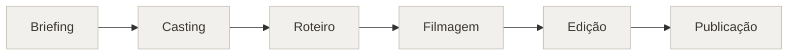
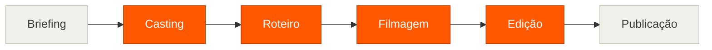

# Influencer Labs

```
Foto do produto → Persona → Roteiro → Cenas em vídeo → Corte final + legendas
```

*Uma campanha UGC deixa de depender de agenda de gravação e vira uma sequência de
chamadas de modelo — você entrega o briefing, o estúdio entrega o vídeo montado.*

---

## 1. O cenário atual

Uma campanha com creator envolve seis etapas e pelo menos três pessoas: alguém
escreve o briefing, alguém encontra e contrata a influencer, alguém escreve o
roteiro, grava-se em estúdio ou em casa, edita-se o corte, e por fim alguém
escreve as legendas para cada rede. Entre o "quero divulgar isso" e o vídeo
publicável passam-se dias, e cada ajuste de roteiro devolve o processo para a
etapa de gravação.



> O gargalo não é criativo, é logístico: testar uma segunda versão do roteiro
> custa uma nova diária de gravação.

## 2. O que muda

O pipeline continua o mesmo — as seis etapas permanecem, na mesma ordem. O que
muda é quem executa as quatro do meio. **O briefing continua seu**, porque é onde
está o conhecimento do produto, e **a publicação continua sua**, porque quando e
onde postar é decisão de negócio. Casting, roteiro, filmagem e edição passam a
ser chamadas de modelo, e por isso deixam de ter custo de agenda.



Em laranja, o que deixou de precisar de pessoas e câmera. Uma foto define a
influencer; o roteiro sai em seis atos com a fala já escrita; cada cena vira um
clipe com áudio; e o corte final é montado no próprio navegador, com transição
cruzada.

## 3. O resultado

- **Refazer uma cena deixa de ser refazer o dia.** As seis são independentes: a
  que ficou ruim é regerada sozinha, pagando só por ela.
- **O custo por campanha cabe num teste.** Cerca de US$ 2,40 na configuração
  atual — barato o bastante para produzir três versões e escolher uma.
- **A entrega sai completa.** Vídeo montado mais legenda, hashtags e dica de
  publicação para Instagram, TikTok e YouTube, no mesmo fluxo.
- **O briefing vira documento.** A etapa de campanha exporta um PDF executivo
  para aprovação de cliente antes de qualquer render.

---

## Os números

Custo real de API por campanha de 6 cenas de 8 segundos, 720p, áudio incluso:

| Variante do Veo | `referenceImages` | US$/s | Campanha |
| --------------- | ----------------- | ----- | -------- |
| `lite` ← **em uso** | não aceita    | 0,05  | ~US$ 2,40 |
| `fast`          | aceita            | 0,15  | ~US$ 7,20 |
| `quality`       | aceita            | 0,40  | ~US$ 19,20 |

Os sete agentes de texto somados ficam abaixo de US$ 0,05 — ruído perto do
vídeo. A cobrança é por segundo de saída bem-sucedida, então cena que falha não
entra na conta.

Trocar de variante é mudar `VEO_MODEL` em [`constants.ts`](constants.ts). As três
limitam `durationSeconds` a 4–8 segundos: **não existe clipe de 10s numa única
geração**. Confirme os preços na página oficial do Google antes de orçar com
cliente.

## Como rodar

```bash
npm install
cp .env.example .env      # preencha GEMINI_API_KEY
npm run dev               # http://localhost:3000
```

| Comando             | O que faz                                  |
| ------------------- | ------------------------------------------ |
| `npm run lint`      | Lint (oxlint)                              |
| `npm run typecheck` | Checagem de tipos (`tsc --noEmit`)         |
| `npm test`          | Testes unitários (vitest)                  |
| `npm run deadcode`  | Exports e dependências não usados (knip)   |
| `npm run build`     | Typecheck + build de produção em `dist/`   |
| `npm run preview`   | Serve o build de produção                  |

O CI (`.github/workflows/ci.yml`) roda lint, typecheck, testes, deadcode e build
em cada PR. Para os mesmos checks localmente antes do commit:
`npx lefthook install`.

### Chave de API

A chave é resolvida em duas fontes, nesta ordem:

1. `GEMINI_API_KEY` do `.env`, injetada no bundle pelo Vite.
2. O seletor de chave do Google AI Studio (`window.aistudio`), quando o app roda
   dentro do AI Studio.

> **Atenção:** este é um app 100% client-side. A chave injetada no build fica
> visível para quem abrir a aba de rede do navegador. Use uma chave restrita e,
> para produção real, coloque um backend na frente da API.

O Veo exige um projeto do Google Cloud com **faturamento habilitado**. Sem isso o
roteiro é gerado normalmente, mas a renderização falha com "modelo não
encontrado".

## Os agentes

Cada etapa é um agente com modelo e prompt próprios, todos em
[`services/geminiService.ts`](services/geminiService.ts).

| # | Agente               | Entrada                        | Saída                        | Modelo             |
| - | -------------------- | ------------------------------ | ---------------------------- | ------------------ |
| 1 | Casting              | Foto da influencer             | Blueprint da persona (PT-BR) | `gemini-3.7-flash` |
| 2 | Estrategista         | Foto do produto + logo         | Briefing de campanha         | `gemini-3.7-flash` |
| 3 | Diretor (vídeo)      | Vídeo de referência            | Diretrizes de estilo         | `gemini-omni-flash-preview` |
| 3b| Diretor (link)       | URL de referência              | Diretrizes de estilo         | `gemini-3.7-flash` |
| 4 | Roteirista           | Briefing + persona + estilo    | Roteiro de 6 cenas (JSON)    | conforme o modo¹   |
| 5 | Diretor de Vídeo     | Cena + narração + estilo       | Prompt otimizado para Veo    | `gemini-3.7-flash` |
| 6 | Renderizador         | Prompt otimizado               | Clipe de 8s (blob)           | `veo-3.1-lite-generate-preview` |
| 7 | Social               | Roteiro completo               | Legendas por plataforma      | `gemini-3.7-flash` |

¹ `fast` → `gemini-2.5-flash-lite`, `balanced` → `gemini-3.7-flash`,
`complex` → `gemini-2.5-pro` com *thinking budget*.

Os cinco agentes de texto compartilham a constante `TEXT_MODEL` em
`services/geminiService.ts`: trocar de modelo é uma linha, não uma varredura.
Os modos `fast` e `complex` do Roteirista continuam apontando para modelos
próprios, porque ali o eixo é custo × profundidade, não uniformidade.

O agente Social (7) roda em segundo plano, em paralelo com a renderização: uma
falha ali não bloqueia o vídeo.

## Decisões que valem explicação

**A narração entra no prompt do Veo.** O Veo 3.x sintetiza fala a partir do
prompt. O agente Diretor de Vídeo obriga o prompt a terminar com
`She says in Brazilian Portuguese: "..."`, mantendo o texto em PT-BR sem
tradução. Sem isso o roteiro é escrito, exibido e editado — e depois descartado,
porque nunca chega ao modelo.

**Consistência de personagem.** A foto da influencer vai ao Veo como
`referenceImages` do tipo `ASSET`, o que segura rosto e roupa entre as cenas —
mas o `lite` rejeita esse campo, então na configuração atual a aparência varia
de cena para cena. O renderizador só envia o campo quando a variante aceita, e
ainda repete a chamada sem ele caso a API responda 400. O toggle na etapa de
Produção se desabilita sozinho e explica por quê.

**O diretor assiste, quando pode.** O Gemini Omni aceita vídeo na entrada e
responde em texto, então enviar o arquivo de referência produz uma análise do
que está de fato no vídeo — duração dos planos, gancho, áudio, enquadramento,
cor. Sem o arquivo, o caminho por URL continua disponível, mas o modelo não abre
o link: ele deduz pela plataforma e pelo perfil. O vídeo vai inline como base64,
daí o teto de `MAX_REFERENCE_VIDEO_BYTES`, e não é salvo junto com o projeto.

**Concorrência limitada.** A cota por minuto do Veo não absorve 6 renderizações
simultâneas. `VIDEO_RENDER_CONCURRENCY` (padrão 2) controla quantas cenas rodam
ao mesmo tempo.

**Falhas têm código, não texto.** Todo erro passa por `classifyFailure` em
[`services/failures.ts`](services/failures.ts) e vira um `code` estável
(`RATE_LIMIT`, `QUOTA`, `SERVER`, `EMPTY_RESPONSE`, …). Retry, mensagem ao
usuário e estorno de crédito decidem pelo código, nunca pelo texto da mensagem.
Isso separa dois casos que compartilham o mesmo HTTP 429: throttling por minuto,
que vale repetir, e saldo esgotado, que falha igual em toda tentativa. O backoff
é exponencial com teto e jitter simétrico, e respeita o `RetryInfo`/`Retry-After`
que a API devolve — se o provedor pedir mais que o teto, o app desiste e avisa em
vez de deixar o usuário esperando.

> O desenho dessa camada foi adaptado do
> [DeepSeek Harness](https://github.com/deepseek-ai/deepseek-harness) (MIT),
> especificamente de `@deepseek-ai/dsh-llm`: a regra de rotear por código e não
> por mensagem, a política de backoff e a distinção entre cota terminal e
> throttling transitório. A configuração de lint, os hooks de git e a estrutura
> do CI vieram do mesmo repositório.

**Créditos.** O custo total é debitado antes de começar, para a confirmação
mostrar um valor exato, e devolvido por cena que falhar. Cenas com erro podem ser
refeitas isoladamente, pagando só por elas.

**Montagem no navegador.** Não há encoder no servidor. Os clipes tocam em dois
elementos `<video>` alternados, são compostos em um `<canvas>` com
*cross-dissolve* e gravados via `MediaRecorder`; o áudio segue o mesmo caminho
por dois `GainNode`. O contêiner de saída é escolhido por
`MediaRecorder.isTypeSupported` (WebM VP9 quando disponível, MP4 como fallback).
Ver [`services/videoMerger.ts`](services/videoMerger.ts).

## A interface

Um workspace de cinco etapas — Persona, Campanha, Roteiro, Produção, Entrega —
todas sempre navegáveis. Dá para voltar e trocar a foto do produto depois de ler
o roteiro sem perder nada.

A barra fixa embaixo diz sempre uma de duas coisas: o que falta para avançar
("Envie a imagem do produto") ou o que a ação vai fazer, com o custo
("Renderizar 6 cenas · 30 créditos"). Nenhum botão fica desabilitado sem
explicar por quê.

Os tokens visuais vivem em [`index.css`](index.css) e são expostos ao Tailwind
em [`tailwind.config.js`](tailwind.config.js). Um acento só (violeta),
superfícies opacas em vez de vidro empilhado, nada de texto abaixo de 13px e
nenhuma cor de texto abaixo de 4.5:1 de contraste.

## Estrutura

```
App.tsx                    Estado do projeto, pipeline e navegação por etapas
constants.ts               Custos, limites, timeouts, variantes do Veo
types.ts                   Tipos compartilhados
services/geminiService.ts  Os 7 agentes e o laço de retry
services/failures.ts       Taxonomia de falhas, backoff e mensagens ao usuário
services/failures.spec.ts  Testes da taxonomia e da política de retry
services/videoMerger.ts    Montagem do corte final (canvas + MediaRecorder)
services/briefingPdf.ts    Export do briefing em PDF (carregado sob demanda)
utils/files.ts             Conversões de arquivo e limitador de concorrência
components/ui.tsx          Primitivas: Button, Panel, Field, Toggle, Badge…
components/Stepper.tsx     Navegação por etapas e a barra de ação fixa
components/MediaUpload.tsx Upload de imagem e vídeo com label e foco visível
components/steps/          Uma etapa do fluxo por arquivo
```

## Limitações conhecidas

- **Sem consistência de personagem na configuração atual.** O `lite` não aceita
  imagem de referência, então rosto e roupa variam entre as cenas. Use `fast` se
  isso importar.
- **Créditos não correspondem a dinheiro.** 30 créditos por campanha versus o
  custo real da tabela acima. A etapa de Produção mostra a estimativa em dólar
  ao lado dos créditos para a diferença ficar visível.
- **Créditos são locais.** `INITIAL_CREDITS` é apenas um contador em memória,
  persistido junto com o projeto. Não há cobrança nem servidor.
- **Os clipes não sobrevivem ao reload.** Salvar o projeto guarda textos e
  imagens no `localStorage`, mas vídeos são blobs em memória — ao recarregar, as
  cenas voltam para "pendente".
- **A análise por URL não abre o link.** O modelo não navega; ele infere as
  diretrizes a partir da plataforma e do perfil na URL. Para uma análise fiel,
  envie o arquivo de vídeo — aí o Omni assiste de verdade. O texto gerado é
  editável antes de entrar no roteiro nos dois casos.
- **A montagem roda em tempo real.** Unir 6 clipes de 8s leva cerca de 48s,
  porque a gravação acompanha a reprodução.
